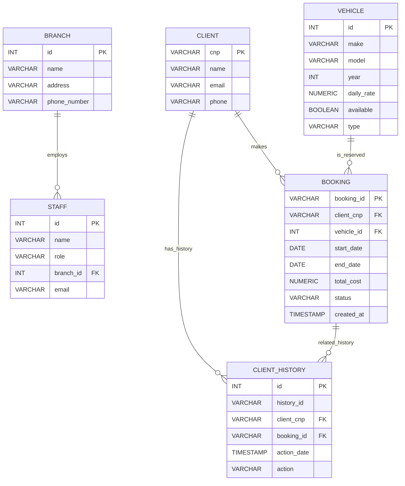

**Proiect: Sistem simplu de închiriere vehicule**

Acest proiect este un demo minimal pentru gestionarea unei flote de vehicule (mașini, motociclete, biciclete), clienți și rezervări. Codul conține modele (entități), servicii care efectuează acțiuni și câteva utilitare pentru prețuri și salvare date.

**Structură generală & roluri**
- **Modele / Entități**: clase simple care rețin date despre obiecte (ex: `Vehicle`, `Client`, `Booking`).
- **Servicii**: clase care implementează logica de business și acțiuni (ex: `VehicleService`, `BookingService`, `ClientService`, `PricingService`, `DataSavingService`).
- **Utilitare / domain objects**: `Invoice`, `RentalAgreement`, `Maintenance`, `VehicleStatus`, `ClientHistory`.
- **`Main`**: demo care construiește obiecte, crează rezervări și arată funcționalități.

**Clase principale și moștenire (scurt)**
- `Rentable` (interfață)
  - Metode: `getDailyRate()`, `isAvailable()`, `setAvailable(boolean)`
  - Default: `estimatePrice(int days)` — oferă calcul estimat pe zile.

- `Vehicle` implements `Rentable`
  - Atribute: `make`, `model`, `year`, `dailyRate`, `available`.
  - Reprezintă tipul comun pentru toate vehiculele.

- `AutoVehicle` extends `Vehicle`
  - Atribut: `engineCapacityCc`.
  - Bază pentru vehicule cu motor.

- `Car` extends `AutoVehicle`
  - Atribute specifice: `licensePlate`, `fuelType`, `mileageKm`.

- `Motorcycle` extends `AutoVehicle`
  - Atribut specific: `hasTopCase`.

- `Bicycle` extends `Vehicle`
  - Atribute: `bicycleType`, `BicycleEquipment equipment`.
- `BicycleEquipment` — wrapper pentru dotări (casca, lanț/încuietoare, lumini, coș).

Alte clase de model / utilitare:
- `Client` — date client, include validare număr de telefon (aruncă `InvalidRomanianPhoneNumberException` dacă e invalid).
- `Booking` — rezervare între un `Client` și un `Vehicle` (date de început/sfârșit).
- `BookingService` — creează rezervări, verifică disponibilitate prin `VehicleService` și marchează vehiculul ca indisponibil.
- `VehicleService` — gestionează lista de vehicule, factory-uri helpers (`createCar`, `createMotorcycle`, `createBicycle`), filtre (toate, disponibile, pe tipuri) și marcaje de disponibilitate.
- `ClientService` — înregistrare și căutare clienți (index pe `cnp` pentru unicitate).
- `PricingService` — calculează prețul total între două date și aplică eventuale discount-uri.
- `DataSavingService` — salvează colecții de date în fișiere text (clienți, vehicule, rezervări etc.).
- `ClientHistory` — păstrează acțiunile istorice ale clienților; conține și clasa `ClientHistoryRecord`.
- `Maintenance`, `VehicleStatus`, `Invoice`, `RentalAgreement`, `Staff`, `Branch` — obiecte suport pentru funcționalități operaționale și raportare.

**Acțiuni importante implementate**
- Creare / înregistrare clienți (`ClientService.createClient`).
- Adăugare vehicule și interogare pe tipuri (`VehicleService.createCar` / `getAllCars` etc.).
- Creare rezervare (`BookingService.createBooking`)  verifică disponibilitatea și blochează vehiculul.
- Calcul preț închiriere (`PricingService.calculateRentalPrice` și `calculateRentalPriceWithDiscount`).
- Salvare date în fișiere (`DataSavingService.saveAllData` [in lucru]).
- Validare telefon românesc în `Client` (aruncare `InvalidRomanianPhoneNumberException`).

**README actualizat — cerințe și mapare**

**1) Listă de acțiuni (exemple, >=15)**
- Creare client
- Citire client
- Actualizare client
- Ștergere client
- Adăugare vehicul
- Listare vehicule (toate)
- Filtrare vehicule disponibile
- Creare mașină/motocicletă/bicicletă (factory methods)
- Creare rezervare
- Listare rezervări active/viitoare
- Marcarea vehiculului ca indisponibil/disponibil
- Generare factură (class `Invoice`)
- Păstrare istoric client (`ClientHistory`)
- Persistare entități în baza de date (CRUD parțial)
- Scriere audit (fisier CSV) la fiecare acțiune

Această listă este acoperită în cod prin clasele de servicii și repository-uri din proiect.

**2) Tipuri de obiecte (exemple, >=10)**n+- Client
- Vehicle
- Car
- Motorcycle
- Bicycle
- Booking
- Invoice
- Branch
- Staff
- ClientHistory / ClientHistoryRecord
- BicycleEquipment

Toate aceste clase se regăsesc sub `src/main/java/com/proiect` (de ex. [src/main/java/com/proiect/Client.java](src/main/java/com/proiect/Client.java)).

**3) Cum sunt îndeplinite cerințele de implementare**
- Clase simple și encapsulare: toate modelele au atribute private și getter/setter (ex.: [src/main/java/com/proiect/Vehicle.java](src/main/java/com/proiect/Vehicle.java)).
- Colecții: `List` (ArrayList) în `VehicleService`, `Set` (HashSet) în `ClientService`, `TreeSet` (sortată) în `ClientHistory` — exemple: [src/main/java/com/proiect/VehicleService.java](src/main/java/com/proiect/VehicleService.java), [src/main/java/com/proiect/ClientService.java](src/main/java/com/proiect/ClientService.java), [src/main/java/com/proiect/ClientHistory.java](src/main/java/com/proiect/ClientHistory.java).
- Moștenire: `Vehicle` → `AutoVehicle` → `Car`/`Motorcycle`; `Bicycle` extinde `Vehicle` (vezi [src/main/java/com/proiect/AutoVehicle.java](src/main/java/com/proiect/AutoVehicle.java)).
- Interfețe: `Rentable` și `GenericRepository<T,ID]` (vezi [src/main/java/com/proiect/Rentable.java](src/main/java/com/proiect/Rentable.java) și [src/main/java/com/proiect/GenericRepository.java](src/main/java/com/proiect/GenericRepository.java)).
- Excepții: `InvalidRomanianPhoneNumberException` definită și folosită în `Client` pentru validarea numărului de telefon ([src/main/java/com/proiect/InvalidRomanianPhoneNumberException.java](src/main/java/com/proiect/InvalidRomanianPhoneNumberException.java)).
- Servicii: `VehicleService`, `ClientService`, `BookingService`, `PricingService`, `DataSavingService` — expun operațiile sistemului (ex.: [src/main/java/com/proiect/BookingService.java](src/main/java/com/proiect/BookingService.java)).
- Clasa `Main`: pornește GUI și inițializează tabele DB (vezi [src/main/java/com/proiect/Main.java](src/main/java/com/proiect/Main.java)).

**4) Persistență JDBC și CRUD**
- Conexiune JDBC: [src/main/java/com/proiect/Database.java](src/main/java/com/proiect/Database.java) (configurare URL/USER/PASSWORD în cod — modifică după nevoie).
- Creare tabele: `Main.createPgAdminTables()` definește tabele inițiale (`branch`, `staff`, `vehicule`/`masini`/`motociclete`/`biciclete`, `clienti`, `rezervari`, `client_history`).
- CRUD: `DataSavingService` conține implementări `GenericRepository` pentru cel puțin 6 entități (ex.: `ClientService`, `BranchService`, `StaffService`, `CarService`, `MotorcycleService`, `BookingServiceRepository`) — vezi [src/main/java/com/proiect/DataSavingService.java](src/main/java/com/proiect/DataSavingService.java).
- Servicii singleton: `DataSavingService.getInstance()` și `AuditService.getInstance()` (ex.: [src/main/java/com/proiect/AuditService.java](src/main/java/com/proiect/AuditService.java)).

**5) Serviciu audit**
- `AuditService` scrie în `audit.csv` pentru fiecare acțiune apelată (format: `nume_actiune,timestamp`). Utilizat în `VehicleService`, `BookingService`, `DataSavingService` etc. (vezi [src/main/java/com/proiect/AuditService.java](src/main/java/com/proiect/AuditService.java)).

**6) Design patterns demonstrate (>=3)**
- Singleton: `AuditService`, `DataSavingService` (`getInstance()` methods).
- Builder: `ClientBuilder` adăugat pentru construire fluentă a obiectelor `Client` ([src/main/java/com/proiect/ClientBuilder.java](src/main/java/com/proiect/ClientBuilder.java)).
- Factory (Factory Method): `VehicleService.createCar/createMotorcycle/createBicycle` (metode care creează instanțe concrete).
- Observer: UI binding JavaFX (`ObservableList` → `ListView`) în [src/main/java/com/proiect/MainController.java](src/main/java/com/proiect/MainController.java).

**7) Interfață grafică (JavaFX)**
- FXML: [src/main/resources/view/interface.fxml](src/main/resources/view/interface.fxml) — conține meniuri, liste și formulare.
- Controller: [src/main/java/com/proiect/MainController.java](src/main/java/com/proiect/MainController.java) — logica UI, legarea la `ClientService` și `VehicleService` și persistare prin `DataSavingService`.

**8) Diagrama ERD**
Mermaid ERD (actualizat) este inclus în repository README pentru referință:



**9) Cum rulezi proiectul**
- Java 17+ recomandat.
- Configurează conexiunea DB în [src/main/java/com/proiect/Database.java](src/main/java/com/proiect/Database.java) (URL/USER/PASSWORD).
- Rulează aplicația (Maven):

```bash
mvn clean javafx:run
```

După pornire, interfața grafică permite adăugarea de clienți și vehicule. Operațiile de persistare folosesc PostgreSQL conform setării din `Database.java` (schimbă dacă folosești alt vendor).

**10) Ce poți extinde / recomandări**
- Adaugă FK explicite în `Main.createPgAdminTables()` pentru `client_history` și `rezervari`.
- Convertește tabelul vehicule într-o singură tabelă `vehicle` cu coloană `type` (simplifică CRUD). 
- Extinde CRUD complet pentru toate repository-urile și adaugă teste unitare.
- Extragerea configurației DB într-un fișier `application.properties` sau în variabile de mediu.

Dacă vrei, pot genera un script SQL de migrare care adaugă FK-urile recomandate și pot crea un fișier ERD PNG/SVG exportat din mermaid.

---

Dacă dorești, fac eu commit cu acest README actualizat; spune mesajul de commit dorit.


