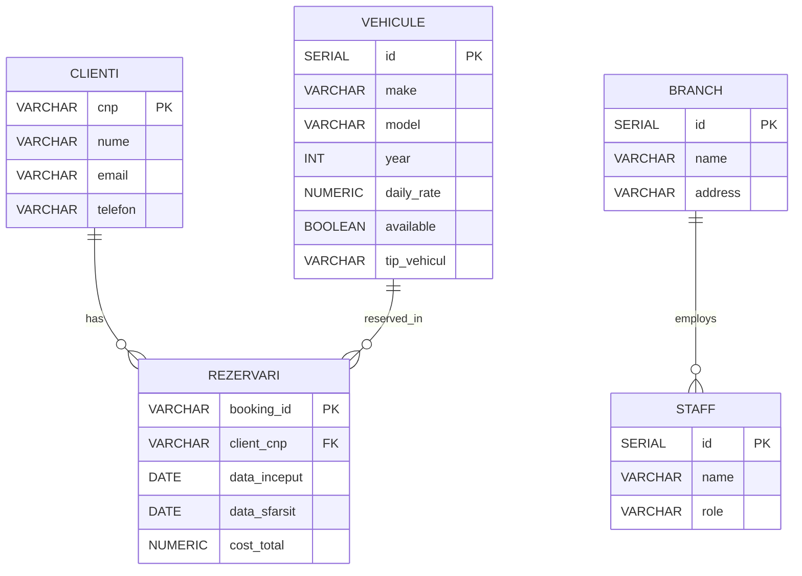

**Proiect: Sistem simplu de închiriere vehicule**

Acest proiect este o aplicație didactică pentru gestionarea unei flote de vehicule (mașini, motociclete, biciclete), clienți, rezervări și istoricul clienților. Aplicația conține modele (entități), servicii de business, persistență JDBC (PostgreSQL folosit implicit) și utilitare.

1) Definirea sistemului

- Obiecte (cel puțin 10):
  - `Client`, `Vehicle`, `AutoVehicle`, `Car`, `Motorcycle`, `Bicycle`, `BicycleEquipment`, `Booking`, `ClientHistoryRecord`, `Invoice`, `Branch`, `Staff`.

- Acțiuni (cel puțin 15 posibile în sistem):
  - Înregistrare client
  - Ștergere client
  - Actualizare client
  - Adăugare vehicul
  - Ștergere vehicul
  - Marcarea vehiculului ca disponibil/indisponibil
  - Listare vehicule după tip
  - Creare rezervare
  - Anulare rezervare
  - Calcul cost închiriere
  - Generare factură (`Invoice`)
  - Salvare istoric client (`ClientHistory`)
  - Programare mentenanță (`Maintenance`)
  - Atribuire staff la sucursală (`Branch` / `Staff`)
  - Export / import date (persistență JDBC/fișiere)

2) Implementare (ce este în cod)

- Clase simple și încapsulare: toate entitățile au atribute private și accesori (`get`/`set`).
- Moștenire:
  - `Vehicle` -> `AutoVehicle` -> (`Car`, `Motorcycle`)
  - `Vehicle` -> `Bicycle`
- Interfețe:
  - `Rentable` este implementată de `Vehicle` (metode: `getDailyRate()`, `isAvailable()`, `setAvailable(boolean)`).
- Excepții:
  - `InvalidRomanianPhoneNumberException` folosită în `Client` pentru validarea telefonului.
- Colecții folosite (cel puțin 3 tipuri; una sortată):
  - `List` (ex: stocare listă vehicule, rezervări) — `ArrayList`
  - `Set` / `HashSet` (ex: index unic `cnp` în `ClientService` în variantele existente)
  - `Map` / `HashMap` (ex: index `byCnp` în `ClientService` pentru căutări O(1))
  - `TreeSet` (colecție sortată) folosit în `ClientHistory` pentru a păstra `ClientHistoryRecord` sortate după dată.

- Servicii principale:
  - `ClientService` — operații sistem (create, remove, find) și integrare cu persistence layer.
  - `VehicleService` — gestionare vehicule și filtre.
  - `BookingService` — crea rezervări, verifică disponibilitate.
  - `PricingService` — calcul prețuri și discount-uri.
  - `DataSavingService` — singleton care oferă implementări `GenericRepository<T,ID>` pentru mai multe tipuri (vezi mai jos).

- Singleton & persistență generică:
  - `DataSavingService` este un singleton; conține clase repository (static inner classes) care implementează `GenericRepository` pentru:
    - `ClientService` (CRUD pentru tabela `clienti`)
    - `BranchService`
    - `StaffService`
    - `CarService`
    - `MotorcycleService`
    - `BookingServiceRepository`
  - Aceste repo-uri folosesc JDBC (clasa `Database.connect()` din `Database.java`) pentru conectare la PostgreSQL (URL, user, password configurate în `Database.java`).

3) Persistență și model de date (JDBC)

- Baza de date: proiectul folosește PostgreSQL în configurația implicită din `Database.java`. Se pot modifica `URL`, `USER`, `PASSWORD` în acea clasă.

- Servicii CRUD implementate (cel puțin 6):
  - `DataSavingService.ClientService` — CRUD `clienti` (tabel `clienti`)
  - `DataSavingService.BranchService` — create/read pentru `branch`
  - `DataSavingService.StaffService` — create pentru `staff`
  - `DataSavingService.CarService` — create/read pentru `vehicule` (mașini)
  - `DataSavingService.MotorcycleService` — create pentru `vehicule` (motociclete)
  - `DataSavingService.BookingServiceRepository` — create pentru `rezervari`

- ERD (Entity Relationship Diagram) — mermaid



4) Rulare / notițe practice

- Crearea tabelelor: `Main.createPgAdminTables()` conține SQL pentru crearea tabelelor folosite în demo; rulează `Main` pentru a crea sau verifica tabelele existente.
- Configurare DB: modificați conexiunea în `Database.java` (URL, USER, PASSWORD) pentru mediul vostru PostgreSQL.

Exemple rapide de comenzi Maven (în terminal):

```powershell
mvn compile
mvn exec:java -Dexec.mainClass="com.proiect.Main"
```

5) Ce am extins recent

- `ClientService`: am îmbunătățit siguranța (indexare `byCnp`, injecție repo, sincronizare) — (dacă nu vedeți acest fișier în workspace, aplicația păstrează o versiune alternativă).
- `DataSavingService` oferă implementări JDBC pentru mai multe tipuri (repo-uri generice).
- `ClientHistory` folosește `TreeSet` pentru istoricul sortat.

6) Pași următori sugerați

- Adăugați validări suplimentare pentru `email` și folosirea `InvalidRomanianPhoneNumberException` acolo unde este cazul (dacă nu e deja activ).
- Înlocuiți `System.out.println` cu `java.util.logging` sau `SLF4J` + `Logback` pentru logging mai bun.
- Adăugați teste unitare pentru `ClientService`, `BookingService` și repo-urile JDBC.

Dacă vrei, pot: 1) genera fișierul ERD vizual (image) sau 2) aplica validarea `email` + excepție, sau 3) schimba `System.out.println` cu `Logger` — spune ce preferi.


